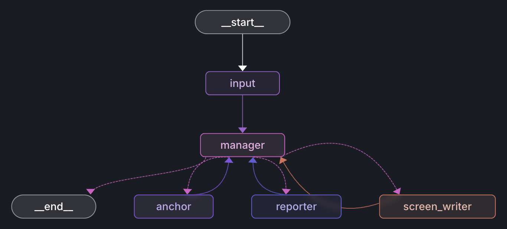

# News Maker (LangGraph + OpenAI TTS)

This project builds a small news pipeline using LangGraph and OpenAI TTS. It writes a short script (screenwriter), then has an Anchor (Sarah Johnson) and a Reporter (Michael Smith) speak their lines with real‑time audio streaming and terminal captions.

## Overview

- Graph: `ask_topic -> manager -> (screen_writer) -> manager -> (anchor|reporter) -> manager -> ... -> END`
- TTS: OpenAI `gpt-4o-mini-tts` streaming PCM; playback via `sounddevice`.
- Captions: printed in the terminal while audio streams.

<div align="center">
  
</div>

Key files:
- `src/graph/graph.py`: builds and compiles the graph
- `src/graph/state.py`: state model and helpers
- `src/graph/nodes/*`: nodes (`ask_topic`, `screen_writer`, `anchor`, `reporter`, `manager`)
- `src/graph/prompts/screen_writer.py`: screenwriter prompt (names, handoff etiquette)
- `src/tts/adapter.py`: minimal streaming TTS adapter (PCM, 24 kHz)

## Requirements

- Python 3.10+
- OpenAI API key in your .env

## Install

```bash
pip install -e .
```

## Run (CLI)

```bash
python -m src.app
```

You’ll be prompted for a topic. Lines will print (captions) and play via speakers.

## Run (Studio)

```bash
langgraph dev
```

Open the Studio URL from the terminal. The graph is configured as `news_maker` in `langgraph.json`.

## Environment variables

Create a `.env` file in the project root:

```env
OPENAI_API_KEY=sk-...
# Optional:
# LANGCHAIN_TRACING_V2=true
# LANGCHAIN_API_KEY=...
```

## Configuration

- TTS voice and sample rate can be adjusted in `src/tts/adapter.py` (defaults: 24 kHz, `alloy`/`verse`).
- Names and handoff instructions are in `src/graph/prompts/screen_writer.py`.